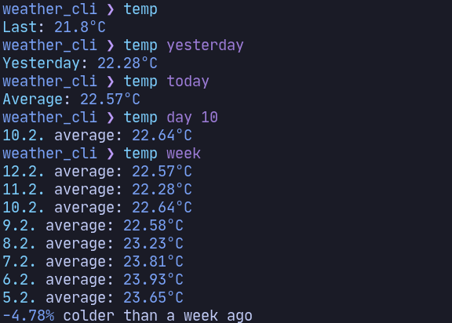

# Weather App Cli

**Simple cli for my weather app**

## Screenshot

 

[weather_app_server](https://github.com/MichalUSER/weather_app_server)
— [weather_app](https://github.com/MichalUSER/weather_app)
— [weather_app_client](https://github.com/MichalUSER/weather_app_client)

